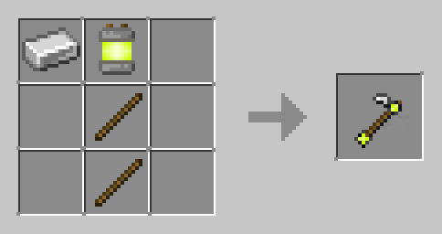
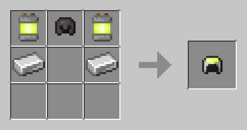
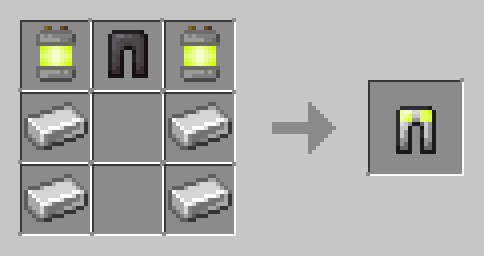

# Batteries, Electric Tools and Power Armor

### Batteries

Batteries are used for all electric tools, but they can also be used as a fuel.
When used in a furnace as a fuel, one battery lasts 3200 ticks (160 seconds).

| Item    | Ingredients                                              | Recipe                                                                 |
|---------|----------------------------------------------------------|------------------------------------------------------------------------|
| Battery | 3 Iron Ingots, 3 Sulfur Powder, 3 Copper Ingots  |  |

### Electric Tools

Electric tools are a new tool tier: the pickaxe, the axe, the hoe, and the shovel all mine a 2 by
2 area. They are based of iron tools, but they also use a battery.

| Tier Material | Durability (Uses) | Mining Speed  Multiplier | Attack Damage  Bonus | Enchantability | Repair Item | 
|---------------|-------------------|------------------------------|--------------------------|----------------|:------------|
| Electric      | 300               | 8                            | 3                        | 1              | Battery     |

 

| Tool    | Ingredients                                  | Crafting Recipe                                                            | Advancements   | 
|---------|----------------------------------------------|----------------------------------------------------------------------------|:---------------|
| Pickaxe | 2 Sticks,  2 Iron Ingots,  1 Battery |  | Obtain Battery |
| Axe     | 2 Sticks,  2 Iron Ingots,  1 Battery |  | Obtain Battery |
| Shovel  | 2 Sticks,  1 Battery                     |  | Obtain Battery |
| Hoe     | 2 Sticks,  1 Iron Ingot,  1 Battery  |  | Obtain Battery |

 

### Electric Tools Repairing

| Method   | Ingredients                         | Recipe                                                                     |
|----------|-------------------------------------|----------------------------------------------------------------------------|
| Crafting | Damaged Electric Tool (2)           |  |
| Grinding | Damaged Electric Tool (2)           |  |
| Anvil    | Damaged Electric Tool (2)           |  |
| Anvil    | Damaged Electric Tool,  Battery |  |

 

### Power Armor
Power Armor is another tier of armor, but each piece of armor gives a different effect. 
To craft them you use batteries.
Armor can be given trims using a smithing template and a trim material.

| Armor Piece               | Durability    | Defense Points | Enchantability | Effect       | Repair Item | 
|---------------------------|---------------|----------------|----------------|:-------------|:------------|
| Electric Boots            | 13 * 20 = 260 | 2              | 1              | Night Vision | Battery     |
| Electric Leggings         | 15 * 20 = 300 | 5              | 1              | Regeneration | Battery     |
| Electric Chestplate       | 16 * 20 = 320 | 6              | 1              | Speed        | Battery     |
| Electric Helmet           | 11 * 20 = 220 | 2              | 1              | Jump Boost   | Battery     |
| Electric  Horse Armor | 13 * 20 = 260 | 5              | 1              | Speed        | Battery     |

 

| Armor       | Ingredients                     | Crafting Recipe                                                             | Advancements   | 
|-------------|---------------------------------|-----------------------------------------------------------------------------|:---------------|
| Helmet      | 4 Iron Ingots,  1 Battery   |   | Obtain Battery |
| Chestplate  | 4 Iron Ingots,  4 Batteries |  | Obtain Battery |
| Leggings    | 5 Iron Ingots,  2 Batteries |  | Obtain Battery |
| Boots       | 2 Iron Ingots,  2 Batteries |  | Obtain Battery |
| Horse Armor |                                 |                                                                             | Obtain Battery |

 

### Power Armor Repairing

| Method   | Ingredients                       | Recipe                                                                      |
|----------|-----------------------------------|-----------------------------------------------------------------------------|
| Crafting | Damaged Power Armor (2)           |  |
| Grinding | Damaged Power Armor (2)           |  |
| Anvil    | Damaged Power Armor (2)           |  |
| Anvil    | Damaged Power Armor,  Battery |  |
