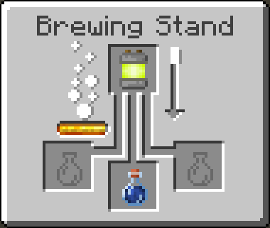

# Electrified Effect and Potions

The Electrified effect is an effect that damages all entities within a few blocks. The entity with the effect
will take damage too, but it will not kill the entity with the effect. This damage can be stopped if you are
wearing a full set of electrical armour.

### Brewing

| Potion                       | Ingredients                        | Brewing Recipe                                                           | Note / Length / Potency |
|------------------------------|------------------------------------|--------------------------------------------------------------------------|:------------------------|
| Electrified Potion           | 3 Iron Ingots, 3 Sulfur Powder |  |                         |
| Electrified Splash Potion    | 3 Iron Ingots, 3 Sulfur Powder |  |                         |
| Electrified Lingering Potion | 3 Iron Ingots, 3 Sulfur Powder |  |                         |
