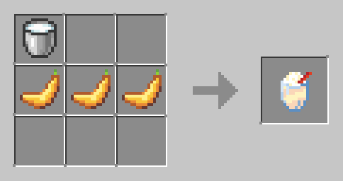

# Food

What goes with sulfur and pollution? Fruit salad obviously! Be careful, don't get a sugar
rush!

 

| Banana                                                           | Fruit Salad                                                                | Milkshake                                                               |
|------------------------------------------------------------------|----------------------------------------------------------------------------|-------------------------------------------------------------------------|
|  |  |  |

 

### Info

| Name               | Ingredients                                   | Recipe                                                             | Advancements                                                         | Saturation / Nutrition            | Effects                                                                   |
|--------------------|-----------------------------------------------|--------------------------------------------------------------------|:---------------------------------------------------------------------|-----------------------------------|---------------------------------------------------------------------------|
| Banana (food)      | N/A                                           | N/A                                                                | N/A                                                                  | 0.5 Saturation  5 Nutrition   | Speed III for 20 sec                                                      |
| Fruit Salad (food) | Bowl, Apple, Banana,  Melon Slice, Coconut |  | Obtain Bowl, or Apple,  or Banana, or Melon Slice,  or Coconut | 1 Saturation  8 Nutrition     | Regeneration I for 20 sec                                                 |
| Milkshake (drink)  | Milk Bucket (1),  Bananas (3)              |  | Obtain Banana                                                        | 0.25 Saturation   8 Nutrition | Speed I for 20 sec,  Haste I for 20 sec,  Jump Boost I for 20 sec |
| Nigiri Sushi (food |                                               |                                                                    |                                                                      | 1 Saturation   2 Nutrition    | Instant Health I with 25% chance                                          |    
| Maki Sushi (food)  |                                               |                                                                    |                                                                      | 1 Saturation   2 Nutrition    | Regeneration I with 25% chance                                            |   