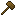
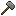
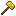
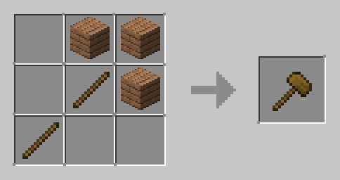
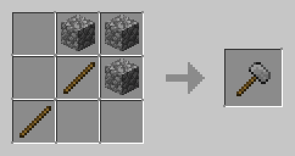
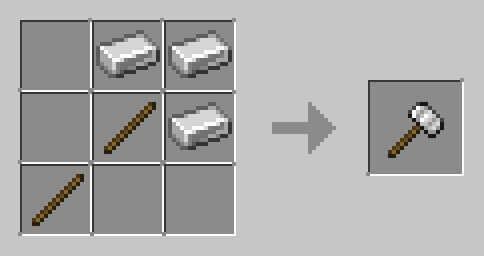
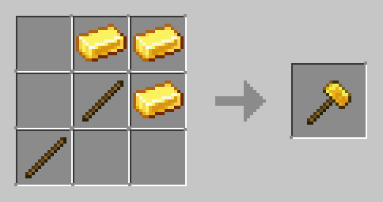
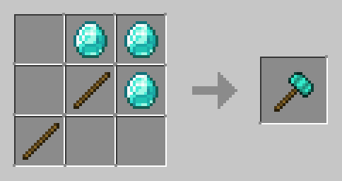

# Hammer

Hammers are extensions of pickaxes: they mine rocks and stones, 
but when you mine Sulfur Ore or Deepslate Sulfur Ore you get Sulfur
Powder directly, skipping the need to smelt the Sulfur Shards into Sulfur Powder.

 

| Wooden                                                                         | Stone                                                                        | Iron                                                                       | Golden                                                                         | Diamond                                                                          |
|--------------------------------------------------------------------------------|------------------------------------------------------------------------------|----------------------------------------------------------------------------|--------------------------------------------------------------------------------|----------------------------------------------------------------------------------|
|  |  |  |  |  |

 

### Recipe

| Tool Tier | Ingredients                      | Crafting Recipe                                                        | Advancements        | Durability |
|-----------|----------------------------------|------------------------------------------------------------------------|:--------------------|:-----------|
| Wooden    | Sticks (2),  any Planks (3)  |  | Obtain Stick        | 59         |
| Stone     | Sticks (2),  Cobblestone (3) |  | Obtain Cobblestone  | 131        |
| Iron      | Sticks (2),  Iron Ingots (3) |  | Obtain Iron Ingot   | 250        |
| Golden    | Sticks (2),  Gold Ingots (3) |  | Obtain Golden Ingot | 32         |
| Diamond   | Sticks (2),  Diamonds (3)    |  | Obtain Diamond      | 1561       |