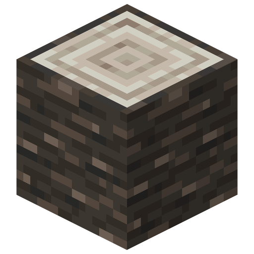
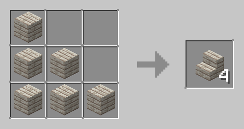

# Palm Tree
[TBD - Palm Tree description - biome generation, planting blocks, shape] 
[TBD - Wood description - color, usage as other logs] 
[TBD - Leaves description] 
[TBD - Coconut description] 

### Blocks and items
These items can be obtained from palm trees:

| Name               | Image                                                                    | Obtaining                                                                                                                      |
|--------------------|--------------------------------------------------------------------------|--------------------------------------------------------------------------------------------------------------------------------|
| Palm Log           |  | Harvested with any tool including hands,  but using an axe is fastest.                                                      |
| Stripped Palm Log  |  | Created by using an axe on a log.                                                                                              |
| Palm Leaves        |  | Hoes are the default tools for breaking leaves,  but leaves can be obtained only with shears or Silk Touch enchanted tools. |
| Stick              |  | [TBD] chance of dropping when breaking leaves                                                                                  |
| Palm Sapling       |  | [TBD] chance of dropping when breaking leaves                                                                                  |
| Coconut            |  | [TBD] chance of dropping when breaking leaves                                                                                  |

### Usage

| Name                | Ingredients                                                                   | Crafting Recipe                                                     | Advancements                                                                         |
|---------------------|-------------------------------------------------------------------------------|---------------------------------------------------------------------|--------------------------------------------------------------------------------------|
| Palm Wood           | Palm Log (4)                                                                  |   | Obtain Palm Log                                                                      |
| Stripped Palm Wood  | Stripped Palm Log (4)                                                         |   | Obtain Stripped Palm Log                                                             |
| Stripped Palm Wood  | Palm Wood                                                                     | Created by using an axe on a wood.                                  |                                                                                      |
| Palm Planks         | Palm Log, or  Stripped Palm Log, or Palm Wood, or Stripped Palm Wood |   | Obtain Palm Log, or  Stripped Palm Log, or Palm Wood, or Stripped Palm Wood |
| Palm Stairs         | Palm Planks (6)                                                               |   | Obtain Palm Planks                                                                   |
| Palm Slab           | Palm Planks (3)                                                               |   | Obtain Palm Planks                                                                   |
| Palm Fence          | Palm Planks (4),  Stick (2)                                                |   | Obtain Palm Planks                                                                   |
| Palm Button         | Palm Planks                                                                   |   | Obtain Palm Planks                                                                   |
| Palm Fence Gate     | Palm Planks (2),  Stick (4)                                                |   | Obtain Palm Planks                                                                   |
| Palm Pressure Plate | Palm Planks (2)                                                               |  | Obtain Palm Planks                                                                   |
| Palm Door           | Palm Planks (6)                                                               |   | Obtain Palm Planks                                                                   |
| Palm Trapdoor       | Palm Planks (6)                                                               |  | Obtain Palm Planks                                                                   |

fuel

- saplings -> potted saplings,
- coconuts -> coconut lamp,
- leaves -> dry

