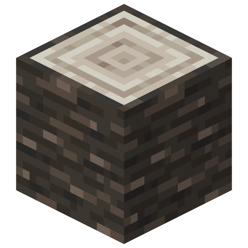
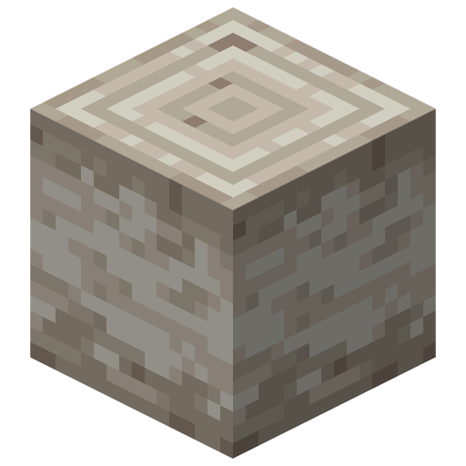
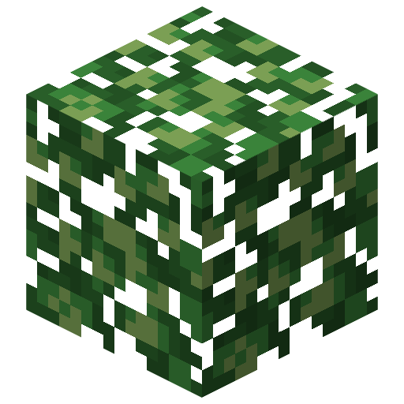
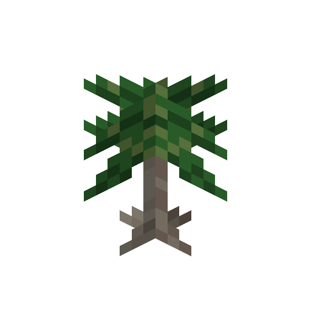

# Rice
[TBD]

### Farming

### Usage

| Name               | Image                                                                    | Obtaining                                                                                                                      |
|--------------------|--------------------------------------------------------------------------|--------------------------------------------------------------------------------------------------------------------------------|
| Palm Log           |  | Harvested with any tool including hands,  but using an axe is fastest.                                                      |
| Stripped Palm Log  |  | Created by using an axe on a log.                                                                                              |
| Palm Leaves        |  | Hoes are the default tools for breaking leaves,  but leaves can be obtained only with shears or Silk Touch enchanted tools. |
| Stick              |  | [TBD] chance of dropping when breaking leaves                                                                                  |
| Palm Sapling       |  | [TBD] chance of dropping when breaking leaves                                                                                  |
| Coconut            |  | [TBD] chance of dropping when breaking leaves                                                                                  |

# Banana
[TBD]

### Farming

### Usage
