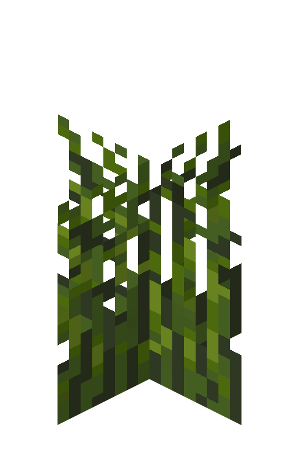
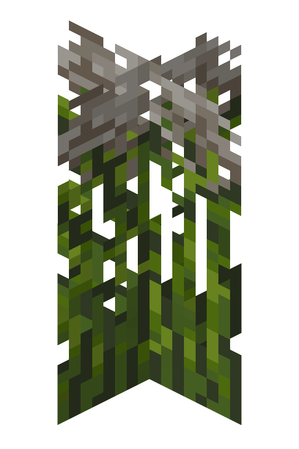
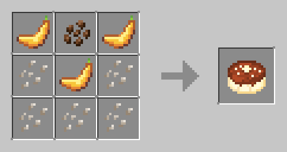
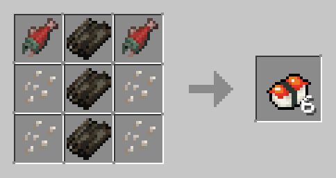
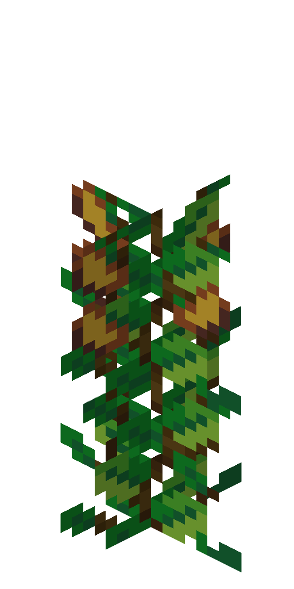
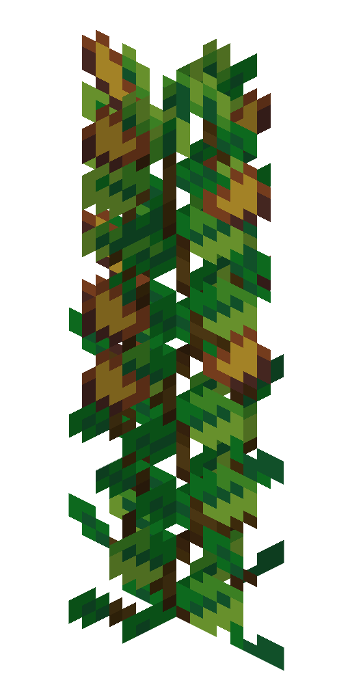

# Rice

Rice plants grow on farmland in 1 block of water and gives rice seeds for food. 
Also, they are two blocks tall.

| Age 0                                                              | Age 1                                                              | Age 2                                                              | Age 3                                                              | Age 4                                                              | Age 5                                                              |
|--------------------------------------------------------------------|--------------------------------------------------------------------|--------------------------------------------------------------------|:-------------------------------------------------------------------|:-------------------------------------------------------------------|:-------------------------------------------------------------------|
|  |  |  |  |  |  |

### Farming

When a fully-grown rice crop is harvested, it drops 1 rice stem and 1 to 4 rice seeds.
A rice crop has a total of 6 stages from the time it is planted until it can be harvested.
If a crop is harvested before it is fully grown, it just drops one seed.
Rice needs a light level of at least 9 to grow. To start farming, you first
till a block. Then, you cover it with a water source block. Lastly, you plant the
rice seed on the farmland.

### Obtain

You can get them from wandering traders, jungle temples, and shipwrecks.

### Usage

| Name                     | Ingredients                                            | Recipe                                                             | Advancements | Saturation /  Nutrition / Effects                                |
|--------------------------|--------------------------------------------------------|--------------------------------------------------------------------|:-------------|----------------------------------------------------------------------|
| Rice Pudding  (food) | Rice Seeds (5),  Bananas (3),  Cocoa Beans (1)   |  | Obtain Rice  | Each slice:  0.4 Saturation   2 Nutrition                    |    
| Maki Sushi  (food)   | Dried Kelp (3),  Rice Seeds (4),  Raw Salmon (2) |  | Obtain Rice  | 1 Saturation   2 Nutrition  Regeneration I with 25% chance   |   
| Nigiri Sushi  (food) | Dried Kelp (3),  Rice Seeds (4),  Raw Salmon (2) |  | Obtain Rice  | 1 Saturation   2 Nutrition  Instant Health I with 25% chance |    

# Banana

[TBD]
Bananas are a food item obtained from banana bushes, and are used to plant them.
Could be found naturally in the biomes: beach, bamboo jungle, forest, meadow, and sparse jungle.

| Age 0                                                                   | Age 1                                                                   | Age 2                                                                   | Age 3                                                                   |
|-------------------------------------------------------------------------|-------------------------------------------------------------------------|-------------------------------------------------------------------------|:------------------------------------------------------------------------|
|  |  |  |  |

### Farming

Placing bananas on a grass block, dirt, coarse dirt, rooted dirt, farmland,
podzol, mycelium, moss block, mud, or muddy mangrove roots creates a small
banana bush that eventually becomes a fully grown banana bush.
A banana bush grows through four stages after it is planted.
Its first growth stage is a small bush without any bananas.
It becomes a 2 block plant in its second stage, and produces bananas in its third and fourth growth stage.
The bush needs to be in light level 9 or greater to grow.
Using bone meal on it increases its growth stage by one,
and at full maturity, ejects the banana item.

### Obtain

Obtain from wandering traders.

### Usage

| Name                     | Ingredients                                          | Recipe                                                             | Advancements                                                             | Saturation /  Nutrition / Effects                                                                            |
|--------------------------|------------------------------------------------------|--------------------------------------------------------------------|:-------------------------------------------------------------------------|------------------------------------------------------------------------------------------------------------------|
| Banana  (food)       | N/A                                                  | Harvest from the banana bush.                                      | N/A                                                                      | 0.5 Saturation  5 Nutrition  Speed I for 20 sec                                                          |
| Fruit Salad  (food)  | Bowl, Apple,  Melon Slice,  Banana, Coconut    |  | Obtain Bowl,  or Apple, or Banana,  or Melon Slice,  or Coconut | 1 Saturation  8 Nutrition  Regeneration I for 20 sec                                                     |
| Milkshake  (drink)   | Milk Bucket (1),  Bananas (3)                     |  | Obtain Banana                                                            | 0.25 Saturation   8 Nutrition  Speed I for 20 sec,  Haste I for 20 sec,  Jump Boost I for 20 sec |
| Rice Pudding  (food) | Rice Seeds (5),  Bananas (3),  Cocoa Beans (1) |  | Obtain Rice                                                              | Each slice:  0.4 Saturation   2 Nutrition                                                                |    
