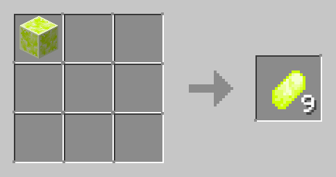

# Sulfur

Sulfur Ore is best mined by a hammer, because you don't need to smelt the Shards.
Sulfur Ore has a hardness of 3, while Deepslate has a hardness of 4.5.
Also, Sulfur Ore,  Deepslate Sulfur Ore, and Sulfur Block glow in the dark with a light level of 10 and emits particles.

 

| Sulfur Ore                                                                 | Deepslate Sulfur Ore                                                                           | Sulfur Block                                                                   | Sulfur Shard                                                                   | Sulfur Powder                                                                    |
|----------------------------------------------------------------------------|------------------------------------------------------------------------------------------------|--------------------------------------------------------------------------------|--------------------------------------------------------------------------------|----------------------------------------------------------------------------------|
|  |  |  |  |  |

### Damage 

Sulfur Ore damages most living entities standing on top of it, dealing 1 damage every tick.

 

### Sulfur Ore and Deepslate Sulfur Ore Drops

| Tool Tier | Pickaxe           | Hammer                       | Silk Touch Pickaxe  | Other |
|-----------|-------------------|------------------------------|---------------------|-------|
| Wooden    | None              | None                         | None                | None  |
| Stone     | None              | None                         | None                | None  |
| Iron      | 1-3 Sulfur Shards | 1-3 Sulfur Powder 2-5 xp | 1 Sulfur Ore Block  | None  |
| Diamond   | 1-3 Sulfur Shards | 1-3 Sulfur Powder 2-5 xp | 1 Sulfur Ore Block  | None  |
| Golden    | None              | None                         | None                | None  |

 

### Usage

| Name          | Ingredients                                                     | Crafting Recipe                                                        | Advancements           |
|---------------|-----------------------------------------------------------------|------------------------------------------------------------------------|------------------------|
| Sulfur Shards | Sulfur Block                                                    |  | Obtain Sulfur Block    |
| Sulfur Block  | Sulfur Shards (9)                                               |  | Obtain Sulfur Shard    |
| Battery       | Iron Ingots (3),  Sulfur Powder (3),  Copper Ingots (3) |  | Obtain Sulfur Powder   |

 

| Name          | Ingredients                        | Smelting Recipe                                                        | Cooking Time       | Exp | Advancements                |
|---------------|------------------------------------|------------------------------------------------------------------------|:-------------------|:----|-----------------------------|
| Sulfur Powder | Sulfur Shard,  any fuel         |  | 100 ticks 5 sec | 0.5 | Obtain Sulfur Shard         |
| Sulfur Powder | Sulfur Ore,  any fuel           |  | 100 ticks 5 sec | 0.5 | Obtain Sulfur Ore           |
| Sulfur Powder | Deepslate Sulfur Ore,  any fuel |  | 100 ticks 5 sec | 0.5 | Obtain Deepslate Sulfur Ore |

 

| Name          | Ingredients                        | Blasting Recipe                                                        | Cooking Time      | Exp | Advancements                |
|---------------|------------------------------------|------------------------------------------------------------------------|:------------------|:----|-----------------------------|
| Sulfur Powder | Sulfur Shard,  any fuel         |  | 80 ticks 4 sec | 0.7 | Obtain Sulfur Shard         |
| Sulfur Powder | Sulfur Ore,  any fuel           |  | 80 ticks 4 sec | 0.7 | Obtain Sulfur Ore           |
| Sulfur Powder | Deepslate Sulfur Ore,  any fuel |  | 80 ticks 4 sec | 0.7 | Obtain Deepslate Sulfur Ore |
