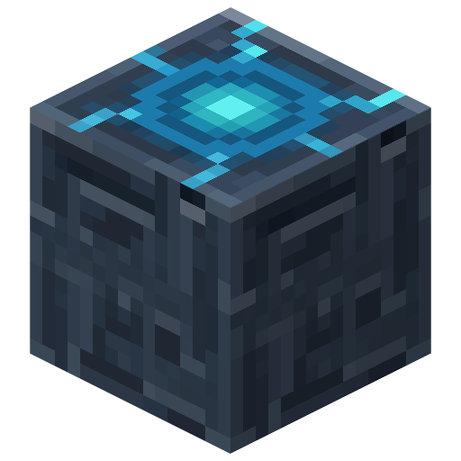

# Teleportaion
The teleportation device, when eaten, teleports you to the nearest placed teleportation stone. 
Instead of putting you
inside of blocks, however, it just teleports you to the first open space above the stone.
 

| Teleportation Stone                                                             | Teleportation Device                                                            |
|---------------------------------------------------------------------------------|:--------------------------------------------------------------------------------|
|  |  |

 

### Obtain
You can get both from wandering traders and the stronghold crossing chest with a fifty percent chance.

### Recipe

| Name                 | Ingredients                                                                               | Crafting Recipe                                                                      | Advancements   |
|----------------------|-------------------------------------------------------------------------------------------|--------------------------------------------------------------------------------------|----------------|
| Teleportation Stone  | Block of Iron (4),  Block of Netherite (2),  Lodestone, Buttery,  Ender Pearl |  | Obtain Battery |
| Teleportation Device | Batteries (2),  Ender Pearl,  Iron Ingot                                          |  | Obtain Battery |
